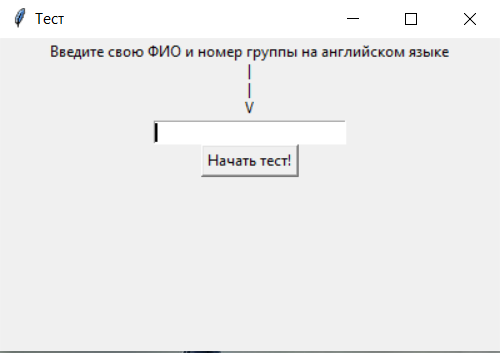

# Тестировщик интеллектуальных качеств пользователя
Данная программа предназначена для тестирования пользователей на предмет знания материала.

## Описание работы интерфейса
При запуске программы отображается интерфейс, куда надо ввести имя пользователя и группу(для понимание, кто сделал тест) на английском языке.

После ввода начинается сам тест, где отображены вопросы(на данный момент 6 случайных вопросов из 18 возможных) и на выбор 4 ответа.

Затем можно нажать на кнопку заканчивания теста. Она отправит результаты с специальной почты на почту преподавателя(ее нужно указать в программе).

## Описание работы программы

Программа построена на [базе вопросов](res/questions_basa.py), [проверки вопросов](res/question_answer.py) и [отправке результата](res/email_post.py).

База вопросов - это некое количество функций, возвращающие значение(вопросы) в зависимости от случайного числа, которое поступает в нее.

Проверки вопросов - это функции по количеству совпадающие с вопросами, которые получают на вход ID(условное) вопроса и ответ на вопрос, которые возвращают 0 или 1 в зависимости от правильности ответа.

Отправка результата - это функция, которая получает на вход все данные, собранные после окончаения теста и отправвляющие по почте результат.

Основные ресурсы для работы программы были: time(для таймера), random(для рандомизации вопросов, их порядка и т.д.), tkinter(для интерфейса) и smtplib(для работы с почтой).
Количества строк кода: ~450

## Установка и запуск программы

Для установки и работы приложения необходим файл [main.exe](https://github.com/Stone-by/Konfiga/releases/download/V1.0/main.exe).
